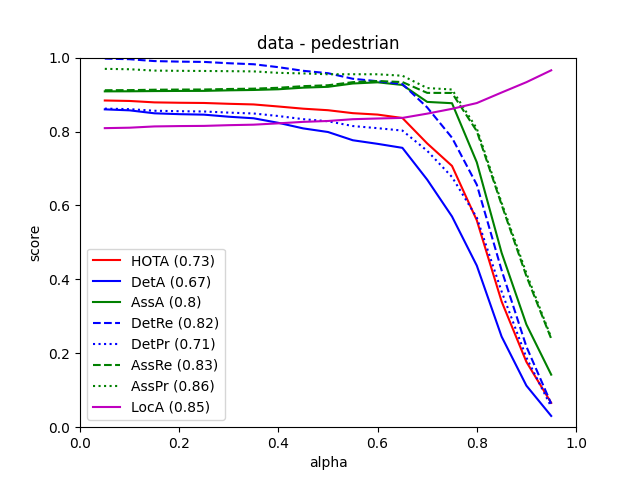
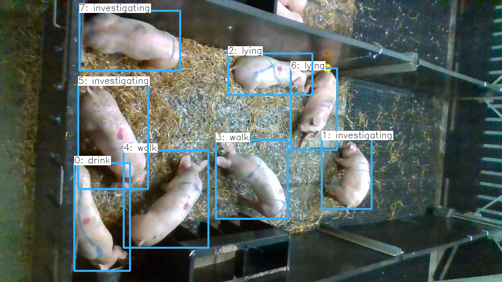
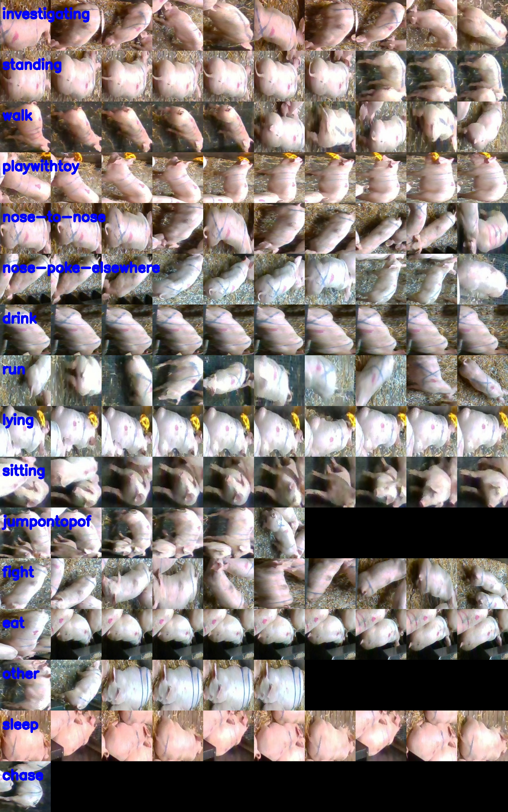

# Repo with experiments for pigs-pose-detection
## Installation 
Run `pip install -r requirements.txt` in `yolo5`, `deep_sort` and `TrackEval` folders

## Experiments
#### Detection
Train yolov5 experiments (use dvc to load dataset and weights):
1) Raw dataset [wandb](https://wandb.ai/pig_detection/pig_detection/runs/2r8922dl) [branch pigs_detection_yolo_dataset] 
2) Mask paddock \+ union classes (8 classes) [wandb](https://wandb.ai/pig_detection/pig_detection/runs/yu2tkxqi) [branch pig_detection_yolo_dataset_masked_union]
3) Mask paddock \+ union classes (4 classes) [wandb](https://wandb.ai/pig_detection/pig_detection/runs/3tux8h4j) [branch pig_detection_yolo_dataset_masked_union_hard]

### Tracking
Evaluate Deep SORT tracker on yolo predictions in [notebook](experement_notebooks/evaluate_tracking.ipynb)

Some metrics:

## Dataset
[Edinburgh Pig Behavior Video Dataset](https://homepages.inf.ed.ac.uk/rbf/PIGDATA/)

